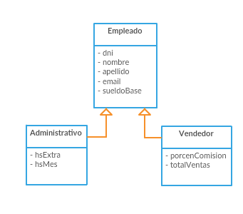

# Enunciados

**Ejercicio 1**

Leer 10 palabras y mostrarlas en orden inverso al que fueron ingresadas.

**Ejercicio 2**

Leer un entero y luego una lista de 20 enteros. Guardar los mayores al número inicial y mostrarlos al final  

**Ejercicio 3**

De acuerdo al diagrama de clases resolver:

Cargar una lista de empleados (máximo 20) preguntado en cada uno si son administrativos o vendedores y cargar todos los datos respectivos.

Luego listar los empleados indicando: dni, nombre, apellido y sueldo.
El sueldo debe calcularse en el método getSueldo() de la siguiente forma:
* Si es administrativo: sueldoBase \* ((hsExtra \* 1.5)+hsMes) / hsMes
* Si es vendedor: sueldoBase + (porcenComision\*totalVtas/100)

**Ejercicio 4**
Tomar el ejemplo Ej5HashMap y listar los valores de map2 ordenados por el Apellido y Nombre de la Persona usando un comparator.
